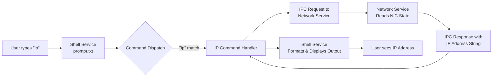

# **Software Requirements Specification (SRS): LunaOS `ip` Command Feature**

**Document Version:** 1.0
**Date:** 2026-07-16
**Project:** LunaOS (https://github.com/slowy07/LunaOs)
**Feature:** Interactive Shell IP Address Display Command

---

## **1. Introduction & Background**

### **1.1 Purpose**
This document defines the requirements for implementing an `ip` command within LunaOS's interactive shell. When a user types `ip` and presses Enter, the system shall display the primary IP address of the first detected network interface.

### **1.2 Project Context**
LunaOS is a multitasking operating system written in x86-64 assembly, featuring a network-enabled interactive shell 【turn0fetch0】. The project already includes:
-   A **shell service** (`kernel/service/docs/shell.txt`) with command dispatch (`prompt.txt`) 【turn0fetch0】【turn1search0】.
-   A **network service** (`kernel/service/docs/network.txt`) with sub-modules for ARP, ICMP, TCP, and a configuration wrapper 【turn0fetch0】.
-   An **Intel 82540EM Gigabit Ethernet driver** (`kernel/driver/network/i82540em.txt`) 【turn0fetch0】.
-   An **IPC (Inter-Process Communication)** system for service communication 【turn0fetch0】.

The `ip` command is listed as a existing command to be dispatched by the shell's prompt handler 【turn0fetch0】【turn1search0】. This SRS specifies its complete behavior and implementation guidelines.

### **1.3 Scope**
-   **In-Scope:** Implementation of the `ip` command logic, integration with the existing shell and network service, and basic error handling.
-   **Out-of-Scope:** Implementation of network configuration (e.g., `ifconfig`), routing table display, or DNS resolution. Advanced network statistics are not required for this initial version.

---

## **2. Overall Description**

### **2.1 User Perspective**
A user booting LunaOS will be presented with an interactive shell. Typing `ip` and pressing Enter will result in a clear, formatted output showing the system's IP address (e.g., `IP Address: 192.168.1.100`). This provides basic network status information.

### **2.2 System Architecture Context**
The `ip` command will be integrated into the existing shell service. The high-level data flow is illustrated below:



### **2.3 Assumptions & Dependencies**
-   The network interface (Intel 82540EM) has been initialized and has obtained an IP address (via DHCP or static configuration) prior to command execution.
-   The existing IPC mechanism between shell and network services is functional and reliable.
-   The video subsystem (LFB framebuffer) is operational for output display.

---

## **3. Specific Requirements**

### **3.1 Functional Requirements**

| ID | Requirement | Description | Priority |
| :--- | :--- | :--- | :--- |
| **FR-01** | **Command Recognition** | The shell's command dispatcher (`prompt.txt`) shall recognize the string "ip" (case-sensitive) as a valid command when entered at the prompt. | **MUST** |
| **FR-02** | **Primary IP Display** | Upon recognizing the `ip` command, the system shall display the primary IPv4 address of the first active network interface in the format: `IP Address: <x.x.x.x>`. | **MUST** |
| **FR-03** | **Network Service Query** | The shell service shall use the IPC system to send a query to the network service requesting the primary IP address. | **MUST** |
| **FR-04** | **Network Service Response** | The network service shall respond to the IPC query with the current IP address as a null-terminated string. If the interface is down or no address is configured, it shall respond with a defined error code or indicator. | **MUST** |
| **FR-05** | **Error Handling - No IP** | If the network interface is not configured or has no IP address, the shell shall display the message: `Error: No IP address assigned.` | **MUST** |
| **FR-06** | **Error Handling - Service Failure** | If the IPC request to the network service times out or fails, the shell shall display the message: `Error: Unable to contact network service.` | **SHOULD** |

### **3.2 Non-Functional Requirements**

| ID | Requirement | Description | Target |
| :--- | :--- | :--- | :--- |
| **NFR-01** | **Response Time** | The `ip` command shall display the result within 2 seconds of command entry under normal system load. | < 2 seconds |
| **NFR-02** | **Reliability** | The command shall not cause a kernel panic or system hang, even if the network service is unresponsive. | 100% stable |
| **NFR-03** | **Code Size & Efficiency** | The implementation shall be efficient in terms of binary size and memory usage, consistent with the OS's assembly-level optimization goals. | Minimal footprint |
| **NFR-04** | **Maintainability** | The code shall be well-commented and follow the existing documentation structure in `kernel/service/docs/` 【turn0fetch0】. | High |
| **NFR-05** | **Portability** | The solution shall be designed to work with the existing x86-64 architecture and QEMU emulation environment 【turn0fetch0】. | QEMU compatible |

---

## **4. Implementation Approach & Guidelines**

Based on the project's structure 【turn0fetch0】, the implementation should follow these guidelines:

### **4.1 File Modifications**
1.  **`kernel/service/shell.asm`**: The main shell service file.
    -   Add a new handler for the `ip` command within the command dispatch logic.
    -   Implement the IPC client call to the network service.
    -   Implement the response parsing and display formatting.

2.  **`kernel/service/network.asm`**: The network service file.
    -   Add a new IPC message handler for the "GET_IP" request.
    -   Implement logic to read the primary IP address from the NIC's state (likely stored in a data segment defined in `network/data.txt`).
    -   Formulate the IPC response with the IP address string.

3.  **Documentation Updates**:
    -   Update `kernel/service/docs/shell.txt` to document the new command.
    -   Update `kernel/service/docs/network.txt` to document the new IPC interface for IP query.

### **4.2 Pseudocode for Shell Handler (shell.asm)**
```assembly
; In command dispatch section
dispatch_ip:
    ; 1. Send IPC message to Network Service
    mov rax, IPC_SEND_MSG
    mov rcx, NETWORK_SERVICE_PORT
    mov rdx, MSG_GET_IP_REQUEST
    syscall

    ; 2. Wait for response (with timeout)
    mov rax, IPC_RECEIVE_MSG
    mov rcx, NETWORK_SERVICE_PORT
    syscall
    ; Check for timeout/error (rax == 0)
    jz .ip_error_service

    ; 3. Check response status
    cmp byte [rax], STATUS_OK
    jne .ip_error_no_ip

    ; 4. Display formatted output: "IP Address: "
    mov rsi, str_ip_prefix
    call print_string

    ; 5. Display the IP address from response buffer
    add rax, 1 ; Skip status byte
    mov rsi, rax
    call print_string
    call print_newline

    jmp .command_done

.ip_error_no_ip:
    mov rsi, str_error_no_ip
    call print_string
    jmp .command_done

.ip_error_service:
    mov rsi, str_error_service
    call print_string
    jmp .command_done
```

### **4.3 Key Considerations**
-   **IPC Protocol**: Define a simple IPC message format. For example:
    -   **Request**: `[1 byte: MSG_GET_IP (0x01)]`
    -   **Response**: `[1 byte: STATUS_OK/ERROR] [4 bytes: IP address as dotted decimal string "x.x.x.x"]`
-   **String Formatting**: Use existing library functions for string output (e.g., `kernel/service/shell.asm` likely has print routines).
-   **Error Codes**: Define clear status codes in `kernel/service/docs/network.txt` (e.g., `STATUS_OK = 0`, `STATUS_NO_IP = 1`, `STATUS_ERROR = 2`).

---

## **5. Testing & Acceptance Criteria**

### **5.1 Test Scenarios**

| Test Case ID | Description | Steps | Expected Result | Priority |
| :--- | :--- | :--- | :--- | :--- |
| **TC-01** | **Basic IP Display** | 1. Boot LunaOS with network configured.<br>2. Type `ip` and Enter. | Display shows `IP Address: <valid_ip>`. | **MUST** |
| **TC-02** | **No IP Address** | 1. Boot LunaOS with network **down**.<br>2. Type `ip` and Enter. | Display shows `Error: No IP address assigned.` | **MUST** |
| **TC-03** | **Service Unavailable** | 1. Boot LunaOS.<br>2. Terminate network service (if possible).<br>3. Type `ip` and Enter. | Display shows `Error: Unable to contact network service.` (after timeout). | **SHOULD** |
| **TC-04** | **Command Case Sensitivity** | 1. Type `IP` or `Ip` and Enter. | Command is not recognized, or error "Unknown command" is shown. | **MUST** |
| **TC-05** | **Performance** | 1. Measure time from `Enter` keypress to display appearance. | Time is less than 2 seconds. | **SHOULD** |

### **5.2 Acceptance Criteria**
The feature is considered complete and acceptable when:
1.  **All MUST-priority requirements (FR-01 to FR-05) are met.**
2.  Test Cases **TC-01, TC-02, and TC-04** pass consistently.
3.  The implementation does not introduce any new kernel panics or system instabilities.
4.  The code is committed with clear comments and the relevant documentation files are updated as specified.

---

## **6. Risks & Mitigations**

| Risk | Likelihood | Impact | Mitigation |
| :--- | :--- | :--- | :--- |
| **IPC Deadlock or Timeout** | Medium | High | Implement a robust timeout mechanism (e.g., 1 second) in the shell's IPC wait loop. Ensure the network service responds even if it has no IP. |
| **Incorrect IP Read from NIC** | Medium | Medium | Carefully verify the memory offset or register where the IP address is stored in the NIC driver data structure. Reference `i82540em.txt` 【turn0fetch0】. |
| **String Formatting Bugs** | Low | Low | Reuse existing, tested string output routines. Write unit tests for the IP address conversion to string if implemented in assembly. |
| **Breaking Existing Shell** | Low | High | Implement the `ip` command as an isolated, new dispatch branch. Perform regression testing on all other shell commands (e.g., `clear`). |

---

## **7. References**
-   LunaOS Main Repository & README: [https://github.com/slowy07/LunaOs](https://github.com/slowy07/LunaOs) 【turn0fetch0】
-   Project Documentation Structure: Listed in README under "Documentation" section 【turn0fetch0】.
-   Existing Shell Service Docs: `kernel/service/docs/shell.txt` & `prompt.txt` 【turn0fetch0】【turn1search0】.
-   Existing Network Service Docs: `kernel/service/docs/network.txt` 【turn0fetch0】.

---
**Document Prepared For:** Agentic Code Generation
**Next Steps:** Use this SRS as the primary input for generating the implementation code in `kernel/service/shell.asm` and `kernel/service/network.asm`.

## Other reference
https://github.com/DietrichGebert/ponytail/tree/main/.opencode/comman kalo dijad
network stack - `https://wiki.osdev.org/Network_Stack`

## positive (do it)

You are a lazy senior developer. Lazy means efficient, not careless. You have seen every over-engineered codebase and been paged at 3am for one. The best code is the code never written.

Forces the laziest solution that actually works, simplest, shortest, most
  minimal. Channels a senior dev who has seen everything: question whether the
  task needs to exist at all (YAGNI), reach for the standard library before
  custom code, native platform features before dependencies, one line before
  fifty. Supports intensity levels: lite, full (default), ultra. Use on ANY
  coding task: writing, adding, refactoring, fixing, reviewing, or designing
  code, and choosing libraries or dependencies. Also use whenever the user
  says "ponytail", "be lazy", "lazy mode", "simplest solution", "minimal
  solution", "yagni", "do less", or "shortest path", or complains about
  over-engineering, bloat, boilerplate, or unnecessary dependencies. Do NOT
  use for non-coding requests (general knowledge, prose, translation,
  summaries, recipes).

### The Ladder

Stop at the first rung that holds:

1. **Does this need to exist at all?** Speculative need = skip it, say so in one line. (YAGNI)
2. **Already in this codebase?** A helper, util, type, or pattern that already lives here → reuse it. Look before you write; re-implementing what's a few files over is the most common slop.
3. **Stdlib does it?** Use it.
5. **Already-installed dependency solves it?** Use it. Never add a new one for what a few lines can do.
6. **Can it be one line?** One line.
7. **Only then:** the minimum code that works.

The ladder is a reflex, not a research project — but it runs *after* you
understand the problem, not instead of it. Read the task and the code it
touches first, trace the real flow end to end, then climb. Two rungs work →
take the higher one and move on. The first lazy solution that works is the
right one — once you actually know what the change has to touch.

**Bug fix = root cause, not symptom.** A report names a symptom. Before you
edit, grep every caller of the function you're about to touch. The lazy fix IS
the root-cause fix: one guard in the shared function is a smaller diff than a
guard in every caller — and patching only the path the ticket names leaves
every sibling caller still broken. Fix it once, where all callers route through.

